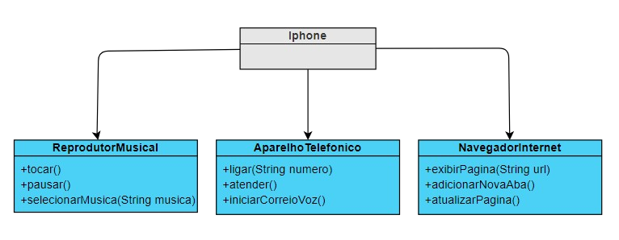

## Modelagem e Diagramação de um Componente iPhone

Neste desafio, você será responsável por modelar e diagramar a representação UML do componente iPhone, abrangendo suas funcionalidades como Reprodutor Musical, Aparelho Telefônico e Navegador na Internet.

## Minha UML dos componente do Iphone

    

## Desafio Proposto aqui:

[GitHub do Projeto](https://github.com/glysns/trilha-java-basico/desafios/poo/README.md)
